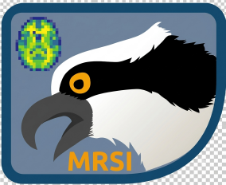

# Osprey-MRSI

Osprey MRSI is an extension of the Osprey MRS toolbox  for state-of-the art processing and quantitative analysis of in-vivo magnetic resonance spectroscopy imaging (MRSI) data.

### Features
- 1-file job definition system for reproducible data analysis
- Automated recognition of input file format and sequence origin
- Fully-automated loading and pre-processing pipeline for optimal SNR, linewidth, phasing, and alignment
- Integrated linear-combination modeling module
- Functions to create custom basis sets and import basis sets from LCModel or Tarquin
- Integrated voxel co-registration and segmentation module (requires SPM12)
- Quantification based on tissue fractions and (customizable) metabolite/tissue water relaxation times
- Atlas-based analysis of the MRSI data
- Interactive GUI to display MRSI data, quality assessment, and quantitative results at each step of the analysis
- Seamless integration with FSLeyes viewer for even more interactive review

### Supported methods
- Conventional MRSI (Spin Echo, FID)
- GABA-edited MEGA Spin Echo MRSI

### Supported file formats
- NIfTI-MRS (see [spec2nii toolbox](https://github.com/wtclarke/spec2nii) for more details about how to convert your data)
- Philips: SDAT/SPAR, DATA/LIST
- Siemens & GE are supported via conversion to NIfTI-MRS

## Getting started

### Prerequisites

Osprey-MRSI requires [MATLAB](https://www.mathworks.com/products/matlab.html) and
has been tested on version 2017a and newer. The following toolboxes are
required for full functionality:

- Optimization
- Statistics and Machine Learning

#### Plotly
Osprey-MRSI uses [plotly](https://plotly.com/matlab/getting-started/) to generate interactive HTML reports (osprey-mrsi/mrsi/OspreyMRSIHTMLReport.m). The dependencies for this are automatically installed during the first function call. Please consult the above reference website for more information.

#### FSLeyes
If you want to use FSLeyes for interactive inspection of the MRSI analysis results, in addtion to the Osprey-native visualization, you will have to install FSLeyes (v0.1.17.0) as described [here](https://fsl.fmrib.ox.ac.uk/fsl/docs/utilities/fsleyes.html).

Make sure the fsleyes-plugin-mrs (v0.1.7) is correclty installed with your FSLeyes. Otherwise follow the instructions described [here](https://git.fmrib.ox.ac.uk/wclarke/fsleyes-plugin-mrs).

For full feature support you will also have to add the viridis colourmap to FSLeyes. Find the location of FSLeyes, e.g., _…/FSLeyes/lib/python3.13/site-packages/fsleyes/assets/colourmaps_, copy the viridis color map file from _osprey-mrsi/mrsi/viridis.cmap_ into the colourmaps folder, and add ‘virdis Viridis’ to the order.txt file located in the same folder.

### Installation

Download the latest **Osprey-MRSI** code from its [GitHub
repository](https://github.com/HJZollner/osprey-mrsi), then extract and add the
entire folder (with subfolders) to your MATLAB path. Make sure to regularly
check for updates, as we frequently commit new features, bug fixes, and improved
functions.

To perform voxel co-registration and tissue segmentation, download **SPM12**
[from the UCL website](http://www.fil.ion.ucl.ac.uk/spm/software/spm12/), then
extract and add to your MATLAB path. If you run an Apple Silicon processor 
(M1 and later), please download the [SPM development version from GitHub](https://github.com/spm/spm).

Make sure to remove Osprey, FID-A, and Gannet from your MATLAB path.

### Example data

Visit the [Open Science Framework](https://osf.io/vkdpr/overview) for more information on how to run the example data.

## Contact, Feedback, Suggestions

To report bugs and problems or to request features, please open a [GitHub Issue](https://github.com/HJZollner/osprey-mrsi/issues).

For all other questions, feedback, suggestions, or critique, please visit either:

- the [Osprey support forum](https://forum.mrshub.org/c/mrs-software/osprey/10) on the [MRSHub](https://www.mrshub.org), if you think your question is of significance to the wider community.

We also welcome your direct contributions to Osprey here in the GitHub repository.

## Developers

- [Helge J. Zöllner](mailto:hzoelln2@jhu.edu)
- [Georg Oeltzschner](mailto:goeltzs1@jhu.edu)

Should you publish material that made use of Osprey, please cite the following publication:

[G Oeltzschner, HJ Zöllner, SCN Hui, M Mikkelsen, MG Saleh, S Tapper, RAE Edden. Osprey: Open-Source Processing, Reconstruction  & Estimation of Magnetic Resonance Spectroscopy Data. J Neurosci Meth 343:108827 (2020).](https://doi.org/10.1016/j.jneumeth.2020.108827)

## Acknowledgements

This work has been supported by NIH grants R01 EB016089, P41 EB15909, P41 EB031771, R01 EB023963, K99/R00 AG062230, R21 EB033516, R01 EB035529, and K99/R00 AG 080084.

We also wish to thank the following individuals for their contributions to the
development of Osprey and shared processing code:

- Jamie Near (McGill University, Montreal)
- Ralph Noeske (GE Healthcare, Berlin)
- Peter Barker (Johns Hopkins University, Baltimore, MD)
- Robin de Graaf (Yale School of Medicine, New Haven, CT)
- Philipp Ehses (German Center for Neurodegenerative Diseases, Bonn)
- Wouter Potters (UMC Amsterdam)
- Xiangrui Li (Ohio State University, Columbus, OH)
- Peter Van Schuerbeek (UZ Brussel)

